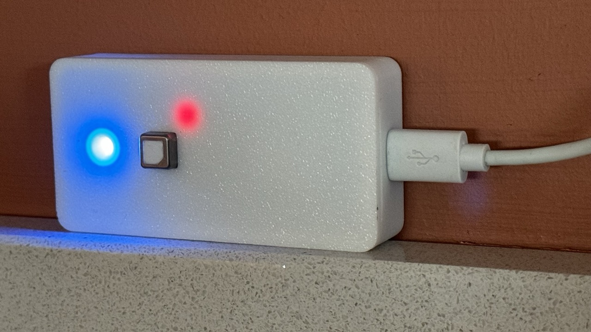

# ESPHome Environment Server

An [ESPHome](https://esphome.io/) sensor for CO2, temperature, and humidity.

## Overview

[Home Assistant](https://www.home-assistant.io/) is a great platform for home automation. It's powerful and has a friendly community. [ESPHome](https://esphome.io/) is an easy way to integrate custom sensors and switches into Home Assistant. This project is an ESPHome configuration file for a custom CO2, temperature, and humidity sensor with colour status light.

The sensor uses an [Az-Delivery D1 Mini](https://www.az-delivery.uk/products/d1-mini?shpxid=b0356ddd-5370-433b-8896-405cbd867c10), a [seeedstudio Sensiron SCD41](https://www.seeedstudio.com/Grove-CO2-Temperature-Humidity-Sensor-SCD41-p-5025.html) CO2, temperature and humidity sensor, and an ordinary RGB led. CO2 is measured every 60 seconds and transmitted to Home Assistant. The status light changes colour from blue to red based on the CO2 level.

This repo contains the schematic, an ESPHome firmware configuration file, and a 3D printer file to construct the one shown.

## Firmware

The firmware is written in [ESPHome](https://esphome.io/). The configuration file is [co2-sensor-d1-mini.yaml](co2-sensor-d1-mini.yaml). Flash the firmware to the D1 Mini using the [ESPHome](https://esphome.io/) dashboard.

The firmware contains functionality to control the colour of the RGB led by converting CO2 level into hue, and from there into red, green, and blue. This is slightly novel as ESPHome doesn't support setting hue directly.
